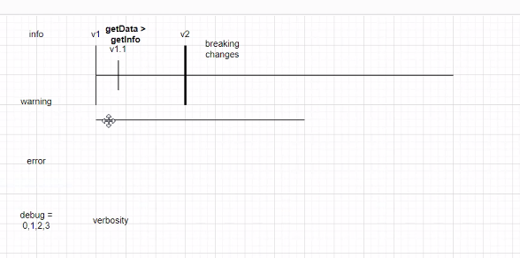
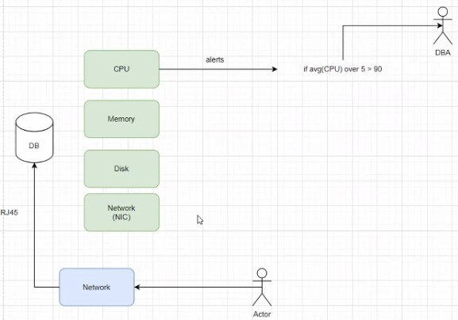
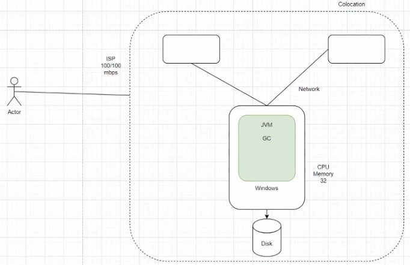

<h1 style="color:rgb(96, 108, 56);">Apuntes Clase 03/03/2023 Bases de Datos II</h1>

Isaac Araya Solano 

Carnet: 2018151703

<h2 style="color:rgb(221, 161, 94);">Logs</h2>

Son la forma más importante que tenemos para identificar problemas en nuestras aplicaciones

Tres tipos de logs:

- Info
- Warning: no son ni errores ni información. No es un error, pero potencialmente puede convertirse en un error
    - Existen las versiones mayores y las versiones menores, las mayores seria por ejemplo 1.0, 2.0. etc y las menores serían tipo 1.1, 1.2, 2.1, etc
    - Cadencia de versionamiento de software: el tiempo que pasa entre cada salida de una versión.
    - Breaking changes: cambios disruptivos que quiebran la compatibilidad entre versiones mayores. 
- Error
    - el usuario nunca debería ver un error(que se caiga el programa) sino que deberían ser manejados
- Debug
    - se asocia a un termino llamado “verbosity” que dice el número de mensajes de debug que se estarán mostrando
    - Cuando se definen logs de debug se le suele asignar un valor de verbosity (0,1,2,3)

Muchas veces se suele generar tantos logs que no se pueden manejar.

- Standard Output (stdout)
    - Suele ser un monitor
    - Cualquier mensaje de info, warning, error o debug se envian al stdout y de ahi se envían al disco

- Standard Input (stdinput)
    - Suele ser el teclado y suele ser resentido por las aplicaciones y el procesador al depender del usuario
  
- Standard Error (stderr)

#### 💡 La información de logs es muy útil pero debe usarse de una manera adecuada para no tener un impacto en el rendimiento de la aplicación.

---
<h2 style="color:rgb(221, 161, 94);">Monitoreo</h2>

Antes existían las alertas condicionales, por ejemplo:

if avg(CPU) over 5 > 90: *enviar mensaje al administrador de la DB*

Los sistemas de monitoreo así se quedaron obsoletos, ej: Nagios

#### 💡 Los software deben estar recibiendo mantenimiento, actualizaciones y usar buenos patrones de programación porque, de no ser así, suelen caer en la obsolescencia y el desuso.

NIC: Network Interface Card

Muchas veces, aunque todos los componentes de una base estuvieran bien, existían problemas de red debido a la transferencia de información. Por esto se empezaron a hacer análisis de las redes completas en lugar de los sistemas por aparte. De aquí nace la Observability.

---
<h2 style="color:rgb(221, 161, 94);">Observability</h2>

Consiste en monitorear todos los aspectos de una base/aplicación en red, incluyendo las interacciones de los usuarios con la misma. 

Colocation: ubicación geográfica donde se encuentra la base de datos. Los servidores de Elasticsearch pueden tener una “colocation” totalmente distinta. 

ISP: Internet Service Provider

Cada red tiene una enorme cantidad de variables como la colocation, ISP, usuarios, etc. El propósito de observability es ver todas las variables de una red como un todo. 

Ej: si el uso de procesador de uno de los servidores está muy alto, observability considera todas las variables posibles de la red que podrían estar causando el problema, incluyendo otros servidores en la red. 

Al ver el sistema como un todo se consiguen identificar las causas de problemas de una manera general y más precisa que si solo se observara cada servidor por aparte.

La observabilidad va de la mano con la elasticidad. Esto implica, por ejemplo, que en tiempo real un sistema computacional crezca o se reduzca. Esto hace que los problemas puedan ser arreglados y que se tomen decisiones en tiempo real. 

API: Application Program Interface

Los sistemas computacionales pueden capturar toda la información generada de una aplicación a través de inteligencia artificial. La IA hace que la observabilidad funcione aun mejor. 

La observabilidad es posible gracias a un tipo de base de datos llamado Timeseries Databases. Deben usarse timestamps, aunque no todos los datos que tengan un timestamp son válidos para las timeseries databases. En general para que un dato sea válido para una timeseries db necesita que sea un dato con un timestamp y que sea de streaming. 

Lo que busca observar un sistema es poder realizar modificaciones o ver cosas en tiempo real, por lo tanto la información antigua no es tan relevante. Es por eso que las bases de datos timeseries son útiles, ya que lo que se hace es mantener los datos más recientes en el almacenamiento más caro y en el mejor hardware de procesamiento de información disponible. Con el pasar del tiempo, esos datos pasan cada vez a un almacenamiento más barato.

Prometheus: Es una base de datos timeseries no sql que se utiliza para monitoreo. Google Cloud permite el uso de prometheus como un Managed Service.

<h3 style="color:rgb(188, 108, 37);">Managed Service:</h3>

Servicio administrado por otra persona, aunque se debe definir las configuraciones y características del servicio.

<h3 style="color:rgb(188, 108, 37);">PaaS:</h3>

Platform as a Service. Se suele trabajar con un url de una plataforma pero no se tiene acceso a las características ni la configuración del servicio.

<h3 style="color:rgb(188, 108, 37);">SaaS:</h3>

Software as a Service. Desarrollan el software un tercero y lo ofrecen como servicio. El que contrata el servicio no tiene ninguna decision sobre la implementación del servicio. Si no le gusta el servicio, pues cambie de proveedor. 

Se suele preferir usar servicios ya que suele ser más barato trabajar con esto a mantener el servicio con recursos propios. A pesar de no conocerse lo que está por detrás.

Ejemplos de empresas de observabilidad:

- Dynatrace
- NewRelic
- Datadog

Estas herramientas suelen trabajar con IAs y las mejores tecnologías. 

Darkweb: cosas ilegales que se hacen en internet, tipo venta de información de hackeos. 

Grafana: interfaz grafica para observar información de prometheus.

Gatling: sistema para hacer pruebas de rendimiento.

Traces: tipo especial de logs.

MariaDB-galera: sistema multimaster