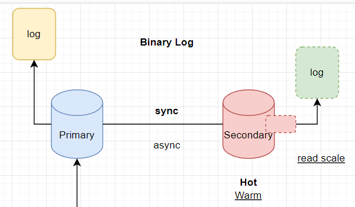
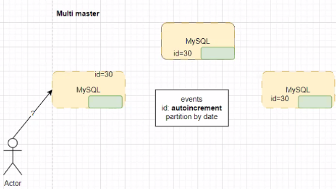
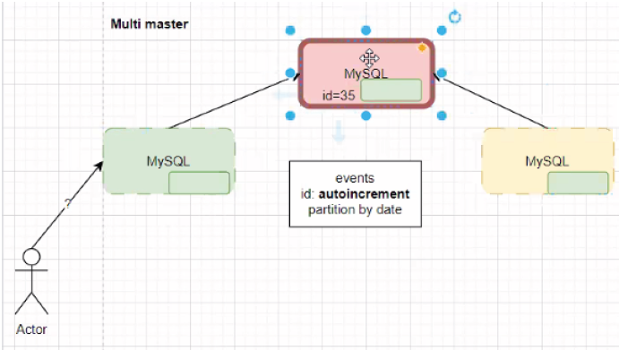
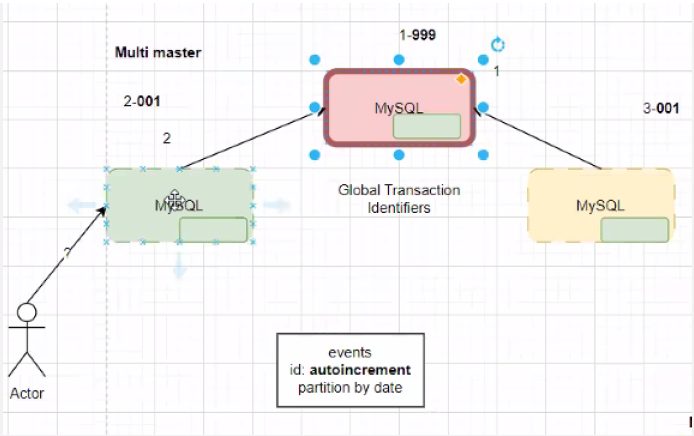
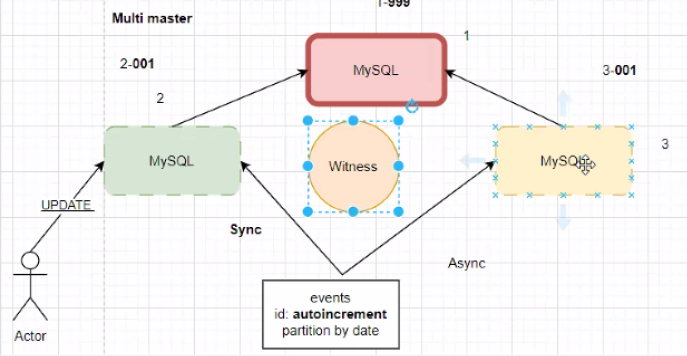
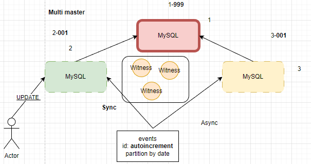
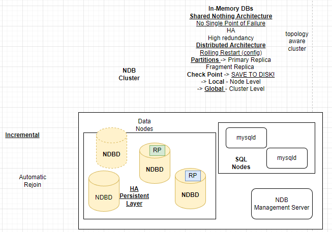
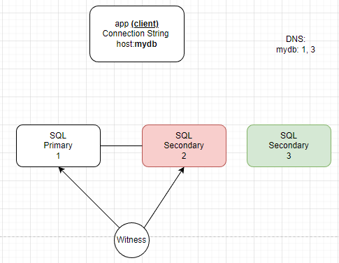

<h1 style="color:rgb(30, 60, 90);">Apuntes Clase 17/03/2023 Bases de Datos II</h1>

### **Isaac Araya Solano**

**Carnet: 2018151703**

## Avisos

Entrega de la Tarea Corta 24/03/2023

**Azure:** En el dashboard tendremos $100 para gastar pero también hay servicios gratis que podemos utilizar. Las herramientas serán necesarias para el proyecto

Link de azure: [https://azure.microsoft.com/en-us/free/students/](https://azure.microsoft.com/en-us/free/students/)

Los servicios solo deben crearlos una persona. 
Link firebase: [https://console.firebase.google.com/](https://console.firebase.google.com/)

## MySQL/MariaDB

Son intercambiables.  MySQL era gratuito. Oracle compró la empresa propietaria de MySQL haciendo que fuera de pago pero luego la comunidad usó MySQL que al ser de código abierto permitió crear MariaDB. MariaDB es mas simple ya que no tiene los features enterprise que si tiene MySQL. MySQL sigue teniendo versiones gratuitas pero suelen pedir inicios de sesión y demás. 

Muchas empresas usaban MySQL y lucraban con ello hasta que fueron demandados y migraron a MariaDB

- Binary Log: Existe un servidor primario o master y uno o varios secundarios. Al escribir en el primary lo enviamos al log y luego lo que hacemos es replicarlo en el log del otro servidor. Una vez el comando está en ambos logs, se ejecuta en el primario y posteriormente en el secundario. Existen dos formas de trabajar:
    - Sincrona: el servidor primario espera por confirmación de que el secundario lo haya escrito
    - Asincrona: el primario escribe independientemente de si el secundario realizó el cambio o no. Esto puede generar problemas ya que se puede perder la transacción en el camino haciendo que el servidor quede desincronizado, provocando que en algún momento se dejen de ejecutar las transacciones
    
    Existen dos formas de funcionamiento del servidor secundario:
    
    - Hot: permite lectura y escritura. Conocido también como read replica y permite algo conocido como read scale. El problema de usar el hot hace que exista la posibilidad de que se de consistencia eventual, haciendo que no estén viéndose los mismos datos al mismo tiempo por dos usuarios diferentes. El problema de bloquear el secundario esperando la confirmación de escritura de los secundarios hace que se generen delays de espera para poder usar el servidor.
    - Warm: Solo permite escritura mas no lectura.

<aside>
💡 Dato curioso: En UK, en invierno, estan usando el calor de los datacenters para calentar piscinas al usar refrigeracion liquida en esos servidores.

</aside>

En MySQL y MariaDB existe el concepto de multimaster. 

- Cluster: cualquier conjunto de servidores/nodos/etc que conformen una base de datos.

Al usar un sistema multimaster donde varios servidores reciben escrituras, se pueden generar problemas con los datos autoincrementales por ejemplo. Si se tiene un esquema multimaster y se tienen 3 servidores se generan ese tipo de problemas. 

Una solución puede ser un algoritmo de consenso, que lo que haria seria preguntarle a todos los servidores que si estan de acuerdo con que se utilice un id o no. Esto es funcional pero puede provocar delays y hace que se puedan dar problemas de que un servidor se quede en espera por muchísimo tiempo. 

Otra opción es que uno solo de los servidores se encargue de hacer la autoincrementación y que los demas le pregunten a ese unico, el problema es que si ese servidor se cae pueden generarse problemas de id repetidos. Este tipo de enfoques se suele utilizar con switch over, es decir que un humano se implica para solucionar el problema. Se dice que este enfoque se conoce como de “un solo punto de fallo”. 

Otro enfoque es tener un archivo central donde todos tienen que preguntarle a ese archivo cual es el siguiente id y consultarlo. De igual forma el problema es que hay un único punto de fallo en este caso igual que en el anterior.  Ejemplos de esto es usar solr cloud y zoo keeper para realizar este enfoque. 

Solución más simple. Cada servidor recibe un numero asignado. Luego cada uno tiene su propia autoincrementación y luego se le coloca el numero asignado a cada uno. Esto hace que nunca se puedan dar llaves repetidas entre servidores. El problema suele ser que los autoincrementales pueden tener un maximo y si se llega a ese máximo pueden haber problemas. Suelen usar una combinación de campos distintos para evitar esos problemas. De igual forma existen los enfoques síncrono y asíncrono. Al tratar de usar estos enfoques distintos se puede provocar bloqueos del sistema.

Existen servicios utilizados para realizar esas sincronizaciones. También servicios de “testigos”. Que básicamente vigilan que todo funcione de manera correcta. Tal vez surja la pregunta de si el sistema de testigos técnicamente no es lo mismo, una base más. Pero los testigos no son bases de datos, son servidores que corren un codigo que no necesita tantas validaciones ni seguridad como una base, haciendo que sea mas veloz y efectivo. 

Zoo Keeper es un sistema de testigos y funciona muchisimo mas rapido ya que tiene varios testigos, tiene alta disponibilidad y es muy rapido. 

- Particiones: tomar un set de datos y asignarle a traves de condiciones, donde se almacenan esos datos. Esto facilita ubicar los datos pero hace que sea necesaria 100% la replicación.
- Operación atómica: solo va a haber un proceso aumentando un numero, haciendo que no se generen esos problemas.

## InnoDB Cluster

Usualmente el innodb genera un replication group, que es un grupo de servidores que funciona como un multimaster y a la vez como un binary log. El usará el binary log como respaldo. Este tipo de grupo funciona con sincronización a través de streaming, enviando las transacciones al binary log pero a la vez se esta aplicando la transaccion en la base, procesan la información y envian la información ya procesada a las otras bases para que inmediatamente escriban sin tener que procesar. Al ingresar un nuevo servidor, el recibe un snapshot* de la base y empieza a recibir trabajo inmediatamente. El servidor esta en recovery mode hasta que esté al dia, y cuando esté al día ya se vuelve funcional y online. Puede darse el caso de que el servidor se caiga y cuando vuelve a estar online llega y le dice a los otros servidores cual fue la ultima transacción que realizó, entonces los otros servidores envian a ese servidor las transacciones que le faltan. Ese servidor entrará a recovery mode e igual esperará a estar al día para poder empezar a trabajar. Se suele crear un API que funciona de intermediario para todas las bases y los usuarios, haciendo que nunca se vea de fuera si un server se cae o no, sino que siempre se está hablando con el API y/o router unicamente. Este InnoDB Cluster usualmente se usa en datacenters. 

*Snapshot: copia de la base de datos hasta ese momento. 

Los servidores vienen en pares:

- mysqld: se encarga de manejar las transacciones
- storage: archivos donde almaceno los datos

## NDBD Cluster

En este caso se separa el storage, haciendo que sea altamente persistente. Esto hace que los datos nunca van a estar en la misma región geográfica y la idea es que las bases de datos de storage siempre esten distanciadas una de otra. 

### In-memory DB:

Es una arquitectura shared nothing, lo que hace que no exista un único punto de fallo. Es un sistema distribuido. 

Tiene la ventaja de que siempre que me pidan datos la información se encuentra en memoria principal. De desventaja tiene que es muy caro tener todo en memoria principal, y el segundo problema es que la memoria es volátil, provocando que se pueda perder la información. De ahi surge el concepto de checkpoint que es un momento donde se le dice a todas las bases: “hey escriban a disco” y las bases hacen un dump incremental. Esto porque no tiene sentido estar escribiendo todos los datos todo el tiempo, sino, unicamente los datos que han cambiado, haciendo que sea una operación bastante rápida. Existen tipos de checkpoint:

- El primero es local y hace que cada nodo vaya a guardar a disco cuando él considere que es momento de ir a guardar a disco.
- El segundo es global y es una orden que se da desde el o los servidores de administración para que todos los datanodes vayan a escribir a disco en cualquier momento.
- Primary Replica: particion que es una tabla dentro de uno de los servidores
- Fragment Replica: copia de la primary replica
- Topology aware cluster: la topología es la cantidad de nodos que tenemos, sus tipos y donde están ubicados. Se busca garantizar que los usuarios estén cerca del nodo que están utilizando.
- Rolling restart/update: el sistema actuará nodo por nodo, haciendo que solo uno esté actualizado poco a poco hasta que al final esté actualizado absolutamente todo.

Se separan los roles, haciendo que hayan servidores que únicamente manejan transacciones pero no almacenan la información. 

### NDB management server

Business continuity plan: Es que cada organización se plantea que van a hacer con el negocio en caso de que se dé un desastre. En este caso hablamos de un contexto de base de datos pero existen multiples conextos. Dentro de esos protocolos está que las personas que viajen en una empresa por ejemplo, no viajen todas juntas. 

Que pasa si un servidor deja de recibir logs, o si se pierde un datacenter, o si un multimaster deja de funcionar por conflicto. 

Se suele hacer un análisis de riesgos para poder analizar como evitarlos y tener una estimación de costos para ver cuanto haria falta gastar para reparar los gastos o ver cuanto costaría evitarlo a ser posible. Dependiendo del area en el que se esté trabajando, variará el plan. 

## SQL Server

Hay varios conceptos que tener presentes:

- Migración y Upgrade: pasar de un servidor fisico a un servidor en la nube por ejemplo. Se conoce como lift and shift.
    - Se da el concepto de refactor, en el que se toma una base de datos, se trabaja un poco y luego se pasa a nube.
    - Luego tambien esta otro concepto llamado replatforming, en el que se analiza una base de datos y se ve si se hay otra base de datos que sea mejor para ese contexto.
    - Priorizar managed services, Saas, Paas.
- Scale read copies: cantidad de replicas modo hot corriendo en un momento dado.
- Warm replica
- Hot/Read Replica
- Peace Maker: marca pasos, equivalente al zoo keeper. Envia pequeños ticks que funcionan como un health check y vigila a los distintos nodos para ver que todo esté funcionando bien.
- Read Scale: cantidad de hot/read replicas
- Mirroring: sistema en el que tengo 2 o más sql servers que van a estar sincronizandose, habrá uno primario/master. Pero no es bueno tener un cluster de unicamente 2 servidores porque cada uno tiene un 50% de los votos, por lo que siempre va a necesitarse un sistema de witness para desempatar, definiendo por ejemplo, cual de los dos servidores será el master.
    - El problema de microsoft es que sus licencias son demasiado caras, haciendo que sea mejor tener un witness que 3 bases de datos.
- Log shipping = binary log
- Tanto en mirroring como en log shipping no hay un fail over automatico, es decir, que si se cae algun servidor, no hay un sistema que detecte automaticamente ese problema. Tiene que haber una app que almacene el ip de cada base, y va a tener un cliente que intenta accesar al servidor. La app es la que debe encargarse de el fail over pero cada vez que se cambie algo la app debe reiniciarse. Para evitar esto hay que usar servicios como DNS
- DNS: Domain Net Services: es uno de los servicios más utilizados. Basicamente es una base de datos de key value pairs donde se mapean nombres e ips. Lo que se hace es que se crea un nombre asignado a un ip y basicamente se envia el nombre de la ip y no la ip en si. Lo bueno es que se puede definir que un nombre conecte con dos ips, ayudando a tener un “fail over automatico” a los ojos del cliente, con ayuda del administrador. 

---

💡Hay que tener en cuenta que estos procesos ya están automatizados en la actualidad.